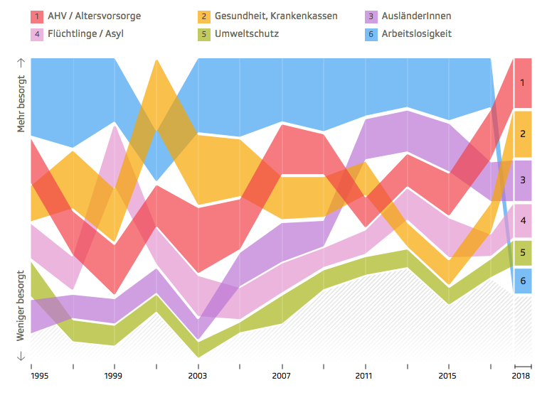

```{r, echo=FALSE}
# CONFIG
user_name <- "srfdata" # github user name
project_name <- "2019-06-worries" # adapt to new repo name
package_date <- "2019-03-01" # date of the CRAN snapshot that
# the checkpoint package uses
R_version <- "3.5.3" # R-Version to use
options(Ncpus = 4) # use 4 cores for parallelized installation of packages
if (R_version != paste0(version$major, ".", version$minor)){
  stop("ERROR: specified R version does not match currently used.")
}
```

### Preliminary Remarks

This document describes the pre-processing and exploratory analysis of the data set that is the basis of the article [Die grössten Sorgen der Schweiz – und womit sie zusammenhängen](https://www.srf.ch/news/schweiz/wahlen-2019/wahlen-2019-die-groessten-sorgen-der-schweiz-und-womit-sie-zusammenhaengen) published on srf.ch.

SRF Data attaches importance to the fact that the data pre-processing and analysis can be reproduced and checked. SRF Data believes in the principle of open data, but also open and comprehensible methods. On the other hand, it should be possible for third parties to build on this preparatory work and thus generate further evaluations or applications.  


### R-Script & Daten

The preprocessing and analysis of the data was conducted in the [R project for statistical computing](https://www.r-project.org/). The RMarkdown script used to generate this document and all the resulting data can be downloaded [under this link](http://`r user_name`.github.io/`r project_name`/rscript.zip). Through executing `main.Rmd`, the herein described process can be reproduced and this document can be generated. In the course of this, data from the folder `input` will be processed and results will be written to `output`. 

SRF Data uses Timo Grossenbacher's [rddj-template](https://github.com/grssnbchr/rddj-template) as the basis for its R scripts. If you have problems executing this script, it may help to study the instructions from the [rddj-template](https://github.com/grssnbchr/rddj-template). 

This report was generated on `r Sys.time()`. R version: `r paste0(version$major, ".", version$minor)` on `r version$platform`. For this report, CRAN packages as of `r package_date` were used.


### GitHub

The code for the herein described process can also be freely downloaded from [https://github.com/`r user_name`/`r project_name`](https://github.com/`r user_name`/`r project_name`).


### Lizenz

<a rel="license" href="http://creativecommons.org/licenses/by-sa/4.0/"></a><br /><span xmlns:dct="http://purl.org/dc/terms/" href="http://purl.org/dc/dcmitype/Dataset" property="dct:title" rel="dct:type">`r project_name`</span> by <a xmlns:cc="http://creativecommons.org/ns#" href="https://github.com/srfdata/`r project_name`" property="cc:attributionName" rel="cc:attributionURL">SRF Data</a> is licensed under a <a rel="license" href="http://creativecommons.org/licenses/by-sa/4.0/">Creative Commons Namensnennung - Attribution ShareAlike 4.0 International License</a>.


### Other projects

Code and data by [SRF Data](https://srf.ch/data) are available on [https://srfdata.github.io](https://srfdata.github.io).


### Disclaimer

The published information has been carefully compiled, but does not claim to be up-to-date, complete or correct. No liability is assumed for damages arising from the use of this script or the information drawn from it. This also applies to contents of third parties which are accessible via this offer.


### Data description of output files 

#### `worries.csv`

| Attribute | Type | Description |
|-------|------|-----------------------------------------------------------------------------|
| year | Numeric | Year of the survey |
| topic | String | Topic (most important problems for the country) |
| value | Numeric | Share in percent of poeple (Swiss, above 18) that are worried about that topic |
| rank | Numeric | Rank of the topic, was it e.g. the number one worry in that year |

#### `requests_per_fraction_and_topic.csv`

Caution: The topics in `worries` are not the same as in the `requests…` tables. Also: In 2012 the Federal Chancellery introduced numerous new topics to their classification system.

| Attribute | Type | Description |
|-------|------|-----------------------------------------------------------------------------|
| year | Numeric | Year (there usually are 4-5 sessions per year) |
| a_author_fraction | String | What fraction submitted the requests |
| total | Numeric | Total number of requests the fraction submitted in that year |
| topic | String | What topic can the request be attributed to (multiple topics per request possible) |
| share | Numeric | Share of that topic in the total of all requests the fraction submitted that year |
| n | Numeric | Number of requests for that topic and fraction in that year |

#### `requests_per_council_and_topic.csv`

| Attribute | Type | Description |
|-------|------|-----------------------------------------------------------------------------|
| year | Numeric | Year (there usually are 4-5 sessions per year) |
| a_council | String | What council submitted the requests |
| total | Numeric | Total number of requests the council submitted in that year |
| topic | String | What topic can the request be attributed to (multiple topics per request possible) |
| share | Numeric | Share of that topic in the total of all requests the council submitted that year |
| n | Numeric | Number of requests for that topic and council in that year |

#### `party_strengths.csv`

| Attribute | Type | Description |
|-------|------|-----------------------------------------------------------------------------|
| year | Numeric | Year of the election |
| party | String | Name of the party |
| strength | Numeric | Share in percent of all votes that that party won in that election |
| delta | Numeric | Change of the strength share of that party compared to the last election |

#### `unemployment_rate.csv`

| Attribute | Type | Description |
|-------|------|-----------------------------------------------------------------------------|
| year | Numeric | Year of measurement |
| rate | Numeric | Proportion of people in Switzerland that were unemployed (average per year) |
| change | Numeric | Change of the rate since 1995 |

#### `asylum_applications.csv`

| Attribute | Type | Description |
|-------|------|-----------------------------------------------------------------------------|
| year | Numeric | Year of measurement |
| applications | Numeric | Number of new applications for asylum in that year (per 31st of December) |
| change | Numeric | Change of the number of applications since 1995 |

#### `immigration.csv`

| Attribute | Type | Description |
|-------|------|-----------------------------------------------------------------------------|
| year | Numeric | Year of measurement |
| immigrants | Numeric | Number of non-swiss immigrants that took up residence in Switzerland |
| change | Numeric | Change of the number of immigrants since 1995 |

#### `health_costs.csv`

| Attribute | Type | Description |
|-------|------|-----------------------------------------------------------------------------|
| year | Numeric | Year of measurement |
| costs | Numeric | Costs of the Swiss health system in millions (CHF) |
| change | Numeric | Change of the number of applications since 1995 |

#### `smd_climate.csv`

| Attribute | Type | Description |
|-------|------|-----------------------------------------------------------------------------|
| year | Numeric | Year searched (1st of Jan until 31st of Dec) |
| articles | Numeric | Number of hits according to smd.ch |
| months | Numeric | Numbers of months searched (mainly relevant for 2019) |
| per_month | Numeric | Number of articles with one of the keywords found |


### Original Source

#### Worries

-> `input/Original_Sorgenbarometer_1988-2018.xlsx`

The research institute gfs.bern and the bank Credit Suisse publish a Worry Barometer each year. [On their website](https://www.credit-suisse.com/microsites/worry-barometer/en.html) they write about the survey: "What are the major concerns of people in Switzerland? How much confidence do they have in decision-makers in the fields of politics, business, and society? For the past 42 years, Credit Suisse has conducted an annual Worry Barometer survey to examine precisely these issues. With the Worry Barometer, Credit Suisse aims to contribute to the public debate on issues of socio-political relevance. [Every summer] the research institute gfs.bern askes [about 2500] voters across Switzerland about their concerns on behalf of Credit Suisse. The statistical sampling error is ±2.0 percentage points."

The survey is conducted the following way: "On these cards you can see some topics that have been discussed and written about a lot recently. Please take a look at all the cards and then put out to me those five of them which you personally consider to be the five most important problems in Switzerland." (orig: «Auf diesen Kärtchen sehen Sie einige Themen, über die in der letzten Zeit viel diskutiert und geschrieben worden ist. Sehen Sie sich bitte alle Kärtchen an und legen Sie mir dann von allen Kärtchen jene fünf heraus, die Sie persönlich als die fünf wichtigsten Probleme der Schweiz ansehen.»)

As they changed their methodology in 1995 and introduced a lot of new topics, **we decided to leave away years before 1995**.

#### Parliamentary procedural requests

-> `input/Analyse_SRG19_P1.RData`
-> `input/modifications_p1.R`

With the help of the team at [Smartvote](https://www.smartvote.ch/) we can also offer (for the first time, as far as we know) all the parliamentary procedural requests (Parlamentarische Vorstösse) from the National Council and the Council of States. The original source of the items of parlamentary business is the Federal Chancellery.

They started the classification of the items in the year 2000. For this reason, we cannot work with requests in the years before 2000.

#### National Council elections

-> `je-d-17.02.02.02.01.01.xlsx`

The **number of seats in the National Council** we download from the Federal Statistical Offices FSO 
[website](https://www.bfs.admin.ch/bfs/de/home/statistiken/kataloge-datenbanken/tabellen.assetdetail.217184.html).

-> `px-x-1702020000_104.csv`

For the **party strenghts** we download a CSV from [Stat-Tab](https://www.pxweb.bfs.admin.ch/pxweb/de/px-x-1702020000_104/px-x-1702020000_104/px-x-1702020000_104.px) where we choose `Switzerland` in the first tab and all the other entries in all the other tabs.

#### Popular Votes

-> `input/popular_votes_1994_2019.csv`

We manually extracted the popular votes from the [list](https://www.bk.admin.ch/ch/d/pore/va/vab_2_2_4_1_gesamt.html) on the Federal Chancellerys website.

#### Unemployment Rate

-> `input/je-d-03.03.02.02.xlsx`

We download the unemployment rate at the [website](https://www.bfs.admin.ch/bfs/de/home/statistiken/kataloge-datenbanken/tabellen.assetdetail.7146832.html) of the Federal Statistical Office FSO.

#### Immigration into Switzerland

-> `input/su-d-01.05.04.02.01.xlsx`

Also the data about immigration we download from the FSO [website](https://www.bfs.admin.ch/bfs/de/home/statistiken/kataloge-datenbanken/tabellen.assetdetail.5886275.html).

#### Applications for Asylum

-> `input/7-20-Bew-Asylgesuche-J-d-…-12.xlsx`

From the [website](https://www.sem.admin.ch/sem/de/home/publiservice/statistik/asylstatistik/uebersichten.html) of the State Secretariat for Migration SEM we download the number of new applications of asylum per year.


#### Costs of the health system

-> `input/je-d-14.05.01.01.xlsx`

For another reference line concerning the cost of the Swiss health system, we work with [this table](https://www.bfs.admin.ch/bfs/de/home/statistiken/gesundheit.assetdetail.6386445.html) by the FSO.

#### Articles concerning climate change

-> `input/smd_climate.csv`

We queried the Swiss Media Database [SMD](http://smd.ch/) with the following search: `erderwärmung OR "globale erwärmung" OR klimawandel OR treibhauseffekt OR klimaschutz OR klimaveränderung OR klimaerwärmung` for each year since 1995 (by manually entering a start and end date of 1st of january and 31st of December each year). Then we manually saved the total number of results into a csv file.


## Preparations

```{r, echo=FALSE}
detach_all_packages <- function() {
  basic_packages_blank <-  c("stats",
                             "graphics",
                             "grDevices",
                             "utils",
                             "datasets",
                             "methods",
                             "base")
  basic_packages <- paste("package:", basic_packages_blank, sep = "")

  package_list <- search()[
    ifelse(unlist(gregexpr("package:", search())) == 1, TRUE, FALSE)]

  package_list <- setdiff(package_list, basic_packages)

  if (length(package_list) > 0)  for (package in package_list) {
    detach(package, character.only = TRUE, unload = TRUE)
    print(paste("package ", package, " detached", sep = ""))
  }
}

detach_all_packages()

# this allows multiple persons to use the same RMarkdown
# without adjusting the working directory by themselves all the time
source("scripts/csf.R")
path_to_wd <- csf() # if this - for some reason - does not work,
# replace with a hardcoded path, like so: "~/projects/rddj-template/analysis/"
if ( is.null(path_to_wd) | !dir.exists(path_to_wd)) {
  print("WARNING: No working directory specified for current user")
} else {
  setwd(path_to_wd)
}

# suppress scientific notation
options(scipen = 999)

# unload global rstudioapi and knitr again to avoid conflicts with checkpoint
# this is only necessary if executed within RStudio
# outside of RStudio, namely in the knit.sh script, this causes RMarkdown
# rendering to fail, thus should not be executed there
if (Sys.getenv("RSTUDIO") == "1"){
  detach_all_packages()
}
```


### Define packages

```{r, echo=TRUE, message=FALSE, warning=FALSE}
# from https://mran.revolutionanalytics.com/web/packages/checkpoint/vignettes/using-checkpoint-with-knitr.html
# if you don't need a package, remove it from here (commenting is probably not sufficient)
# tidyverse: see https://blog.rstudio.org/2016/09/15/tidyverse-1-0-0/
cat("
library(rstudioapi)
library(tidyverse) # ggplot2, dplyr, tidyr, readr, purrr, tibble
library(ggrepel) # repelling texts on ggplot
library(magrittr) # pipes
library(lintr) # code linting
library(sf) # spatial data handling
library(rmarkdown)",
file = "manifest.R")
```


### Install packages

```{r, echo=TRUE, message=FALSE, warning=FALSE}
# if checkpoint is not yet installed, install it (for people using this
# system for the first time)
if (!require(checkpoint)) {
  if (!require(devtools)) {
    install.packages("devtools", repos = "http://cran.us.r-project.org")
    require(devtools)
  }
  devtools::install_github("RevolutionAnalytics/checkpoint",
                           ref = "v0.3.2", # could be adapted later,
                           # as of now (beginning of July 2017
                           # this is the current release on CRAN)
                           repos = "http://cran.us.r-project.org")
  require(checkpoint)
}
# nolint start
if (!dir.exists("~/.checkpoint")) {
  dir.create("~/.checkpoint")
}
# nolint end
# install packages for the specified CRAN snapshot date
checkpoint(snapshotDate = package_date,
           project = path_to_wd,
           verbose = T,
           scanForPackages = T,
           use.knitr = F,
           R.version = R_version)
rm(package_date)
```


### Load packages

```{r, echo=TRUE, message=FALSE, warning=FALSE}
source("manifest.R")
unlink("manifest.R")
sessionInfo()
```

### Read in Data

#### Worries (barometer)

```{r read and export data about worries}

# read table of survey conducted by GFS Bern
worries <- readxl::read_excel(
  "input/Original_Sorgenbarometer_1988-2018.xlsx"
) %>%
  rename(year = 1) %>%
  gather(topic, value, -one_of("year")) %>%
  # reduce to years after 1995 because before that,
  # the question asked was different than afterwards
  filter(year >= 1995) %>%
  # add a rank by grouping / arranging per year
  # what's not perfect though: when two topics have the same value, they're
  # ordered in the way they occur (so pretty randomly)
  group_by(year) %>%
  arrange(desc(value)) %>%
  mutate(rank = row_number()) %>%
  ungroup() %>%
  # if there is no value, we also don't want it to have a rank
  mutate(rank = ifelse(is.na(value), NA, rank)) %>%
  # convert to correct data type
  mutate(topic = factor(topic)) %>%
  # sort nicely
  arrange(year, rank)

# export
write_csv(
  worries,
  "output/worries.csv"
)

```


#### Parliamentary procedural requests

```{r read data about procedural requests}

# read data of parlamentary affairs collected by smartvote
load("input/Analyse_SRG19_P1.RData")

# give more meaningful names to variables
# a = affairs, c = councillor
affairs_data_raw <- a_details
affairs_and_councillors_data <- a_details1
# data from now on filtered to time after year 2000
affairs_and_councillors_with_topics <- a_details2
affairs_per_year_and_council_raw <- a_details3_1
requests_per_year_and_council <- a_details4_1
requests_per_council_topic_shares <- a_details5_1
# affairs now reduced to procedural requests only
affairs_per_fraction <- a_details3_2
requests_per_year_and_fraction <- a_details4_2
requests_per_fraction_topic_shares <- a_details5_2

issue_names <- c(
  "^issue_08$" = "Internationale Politik",
  "^issue_09$" = "Sicherheitspolitik",
  "^issue_10$" = "Europapolitik",
  "^issue_15$" = "Wirtschaft",
  "^issue_44$" = "Beschäftigung Arbeit",
  "^issue_55$" = "Landwirtschaft",
  "^issue_24$" = "Finanzwesen",
  "^issue_2446$" = "Steuer",
  "^issue_28$" = "Soziale Fragen",
  "^issue_2811$" = "Migration",
  "^issue_2836$" = "Sozialer Schutz",
  "^issue_2841$" = "Gesundheit",
  "^issue_2846$" = "Raumplanung Wohnungswesen",
  "^issue_2831$" = "Kultur",
  "^issue_32$" = "Bildung",
  "^issue_36$" = "Wissenschaft Forschung",
  "^issue_34$" = "Medien Kommunikation",
  "^issue_48$" = "Verkehr",
  "^issue_52$" = "Umwelt",
  "^issue_66$" = "Energie",
  "^issue_04$" = "Staatspolitik",
  "^issue_0421$" = "Parlament",
  "^issue_12$" = "Recht allgemein",
  "^issue_1211$" = "Zivilrecht",
  "^issue_1216$" = "Strafrecht",
  "^issue_1221$" = "Gerichtswesen",
  "^issue_1231$" = "Internationales Recht",
  "^issue_1236$" = "Menschenrechte"
)

# function that makes the data frame tidy and replaces issue ids with real names
gather_and_convert_to_numbers <- function (df) {
  df %>%
    # convert columns to rows
    gather(topic, share, starts_with("issue_")) %>%
    mutate(topic = str_replace_all(topic, issue_names)) %>%
    rename(total = N) %>%
    mutate(
      share = share / 100,
      n = round(total * share, digits = 0)
    )
}

# apply to requests per council
requests_per_council_and_topic <-
  requests_per_council_topic_shares %>%
  gather_and_convert_to_numbers()

# and to requests per fraction
requests_per_fraction_and_topic <-
  requests_per_fraction_topic_shares %>%
  gather_and_convert_to_numbers()

# clean up
rm(
  a_details,
  a_details1,
  a_details2,
  a_details3_1,
  a_details3_2,
  a_details4_1,
  a_details4_2,
  a_details5_1,
  a_details5_2,
  gather_and_convert_to_numbers
)

# export
write_csv(
  requests_per_council_and_topic,
  "output/requests_per_council_and_topic.csv"
)

write_csv(
  requests_per_fraction_and_topic,
  "output/requests_per_fraction_and_topic.csv"
)

```

The raw data contain the following form of affairs:

```{r quick inspection of categories of affairs}

knitr::kable(
  affairs_data_raw %>%
    group_by(a_type) %>%
    tally() %>%
    arrange(desc(n))
)

```


### Visual Analysis

#### Parliamentary procedural requests

```{r plot total number of requests}

ggplot(
  requests_per_fraction_topic_shares,
  aes(
    x = year,
    y = N
  )
) +
  geom_bar(stat = "identity") +
  theme_minimal() +
  labs(
    title = "Total number of parlamentary procedural requests",
    y = NULL,
    x = NULL
  )

```

```{r}

ggplot(
  requests_per_fraction_and_topic,
  aes(
    x = topic,
    y = n
  )
) +
  geom_bar(stat = "identity") +
  facet_wrap(~ year, ncol = 4) +
  theme_minimal() +
  theme(axis.text.x = element_text(angle = 45, hjust = 1))


```


```{r plot requests per topic and party, fig.height = 20, fig.width = 10}

fraction_colors <- c(
  "Christlichdemokratische Fraktion" = "#D6862B",
  "Evangelische und Unabhängige Fraktion" = "#DEAA28",
  "Fraktion der Schweizerischen Volkspartei" = "#4B8A3E",
  "Fraktionslos" = "#9D9D9D",
  "Freisinnig-demokratische Fraktion" = "#3872B5",
  "Grüne Fraktion" = "#84B547",
  "Liberale Fraktion" = "#618DEA",
  "Sozialdemokratische Fraktion" = "#F0554D",
  "EVP/EDU Fraktion" = "#DEAA28",
  "Fraktion CVP/EVP/glp" = "#D6862B",
  "FDP-Liberale Fraktion" = "#3872B5",
  "Fraktion BD" = "#E6C820",
  "Fraktion CVP-EVP" = "#D6862B",
  "Grünliberale Fraktion" = "#C4C43D",
  "CVP-Fraktion" = "#D6862B"
)

ggplot(
  requests_per_fraction_and_topic,
  aes(
    x = year,
    y = n,
    fill = a_author_fraction
  )
) +
  geom_bar(stat = "identity") +
  facet_wrap(~ topic, ncol = 4) +
  scale_fill_manual(values = fraction_colors, guide = FALSE) +
  theme_minimal() +
  theme(axis.text.x = element_text(angle = 45, hjust = 1)) +
  labs(
    title = "Number of requests per topic (colors correspond to parties)",
    x = NULL,
    y = NULL
  )

```

```{r export of relevant bar charts for publication}

ggplot(
  requests_per_fraction_and_topic %>%
    group_by(year, topic) %>%
    summarise(n = sum(n, na.rm = TRUE)) %>%
    filter(topic %in% c("Gesundheit")),
  aes(
    x = year,
    y = n
  )
) +
  geom_bar(stat = "identity") +
  facet_wrap(~ topic, ncol = 4) +
  theme_minimal()

```


```{r plot requests per party over time, fig.height = 20, fig.width = 8}

# select a more or less random list of some topics to inspect a bit closer
relevant_topics <- c(
  "Umwelt",
  "Energie",
  "Europapolitik",
  "Sicherheitspolitik",
  "Migration"
)

ggplot(
  requests_per_fraction_and_topic %>%
    filter(topic %in% relevant_topics),
  aes(
    x = year,
    y = n,
    group = topic,
    color = topic
  )
) +
  geom_line() +
  facet_wrap(~ a_author_fraction, ncol = 1, scales = "free_y") +
  theme_minimal() +
  labs(
    title = "Parlamentary fractions: Five relevant topics over time",
    x = NULL,
    y = NULL
  )

```

#### Worries

To find out in what way we will display the worries in the final publication, we try different approaches to selecting topics and years. As the amount of data can get overwhelming pretty quickly, we need to find a clear focus to concentrate on.

##### Sorted by median (Top 20)

```{r}

knitr::kable(
  worries %>%
    group_by(topic) %>%
    summarise(value = median(value, na.rm = TRUE)) %>%
    arrange(desc(value)) %>%
    top_n(20, wt = value)
)

```

##### Biggest worries

###### As Areas

```{r plot worries}

number_of_top_worries <- 10

manually_selected_top_5 <- c(
  "Arbeitslosigkeit",
  "Flüchtlinge / Asyl",
  "AusländerInnen",
  "AHV / Altersvorsorge",
  "Umweltschutz"
)

# filter for most important groups
worries_sorted <- worries %>%
  group_by(topic) %>%
  mutate(
    # for median calculation, replace NAs with zero
    value = ifelse(is.na(value), 0, value),
    median = median(value, na.rm = TRUE)
  ) %>%
  arrange(desc(median)) %>%
  distinct(topic) %>%
  simplify()

worries %<>%
  mutate(topic = factor(topic, levels = worries_sorted)) %>%
  arrange(topic, year)

# use head instead of top_n to get an exact number
big_worries <- head(worries_sorted, number_of_top_worries)
# uncomment the following if you want to use the manual selection
# big_worries <- manually_selected_top_5

other_worries <- worries %>%
  filter(!topic %in% big_worries) %>%
  group_by(year) %>%
  summarise(value = sum(value, na.rm = TRUE)) %>%
  mutate(topic = "Andere")

ggplot(
  worries %>%
    filter(topic %in% big_worries),
  aes(
    x = year,
    y = value
  )
) +
  geom_area() +
  facet_wrap(~ topic) +
  theme_minimal() +
  labs(
    title = "Biggest worries",
    x = NULL,
    y = NULL
  )

```

###### In one Plot

```{r}

ggplot(
  worries %>%
    filter(topic %in% big_worries) %>%
    filter(year %% 4 == 3 | year == max(year)),
  aes(
    x = year,
    y = value,
    color = topic
  )
) +
  geom_line() +
  scale_color_brewer(palette = "Set1") +
  theme_minimal() +
  labs(
    title = "Top worries over time (only election years and latest)",
    fill = NULL,
    x = NULL,
    y = NULL
  )

```

##### Bump Chart

```{r show rank only of worries, fig.height = 8, fig.width = 14}

ranks_of_worries <- worries %>%
  # add hex code for some topics to highlight them
  mutate(color = case_when(
    topic == "Arbeitslosigkeit" ~ "#e31f2b",
    topic == "Flüchtlinge / Asyl" ~ "#61b13e",
    topic == "AusländerInnen" ~ "#1cb373",
    topic == "AHV / Altersvorsorge" ~ "#1e8ce3",
    topic == "Umweltschutz" ~ "#ca51af",
    TRUE ~ "#d9d9d9"
  ))

ggplot(
  ranks_of_worries,
  aes(
    x = year,
    y = rank,
    color = color,
    group = topic,
    label = topic
  )
) +
  geom_line() +
  geom_point(size = 2) +
  geom_text_repel(
    data = ranks_of_worries %>%
      filter(year == max(year)),
    segment.size = 0.25,
    segment.color = "black",
    nudge_x = 0.5,
    hjust = 0,
    direction = "y"
  ) +
  scale_y_continuous(trans = "reverse", limits = c(20, 1)) +
  scale_color_identity() +
  xlim(min(ranks_of_worries$year), max(ranks_of_worries$year) + 7) +
  theme_minimal() +
  theme(legend.position = "none") +
  labs(
    title = "Rank of worries (labelled are only top 20 in 2018)",
    x = NULL,
    y = NULL
  )

# tmp filter list to display only 20 lines in a chart
top_20_2018 <- ranks_of_worries %>%
  filter(year == max(year)) %>%
  arrange(rank) %>%
  head(20) %>%
  select(topic) %>%
  simplify()

```

###### Only Most important ones

```{r}

ggplot(
  ranks_of_worries %>%
    filter(year %% 2 == 1) %>%
    filter(topic %in% big_worries),
  aes(
    x = year,
    y = rank,
    color = color,
    group = topic,
    label = topic
  )
) +
  geom_line() +
  geom_point() +
  scale_x_continuous(
    breaks = seq(1995, 2015, 4),
    limits = c(min(ranks_of_worries$year), max(ranks_of_worries$year) + 8)
  ) +
  scale_y_continuous(trans = "reverse", limits = c(20, 1)) +
  scale_color_identity(guide = FALSE) +
  geom_text_repel(
    data = ranks_of_worries %>%
      filter(year %% 2 == 1) %>%
      filter(topic %in% big_worries) %>%
      filter(year == max(year)),
    segment.size = 0.25,
    segment.color = "black",
    nudge_x = 0.5,
    hjust = 0,
    direction = "y"
  ) +
  theme_minimal() +
  labs(
    title = "Top 10 worries ordered by rank",
    x = NULL,
    y = NULL
  )

```

```{r}

ggplot(
  ranks_of_worries %>%
    filter(year %% 2 == 1) %>%
    filter(topic %in% big_worries),
  aes(
    x = year,
    y = value,
    color = color,
    group = topic,
    label = topic
  )
) +
  geom_line() +
  geom_point() +
  scale_x_continuous(
    breaks = seq(1995, 2015, 4),
    limits = c(min(ranks_of_worries$year), max(ranks_of_worries$year) + 8)
  ) +
  scale_color_identity(guide = FALSE) +
  geom_text_repel(
    data = ranks_of_worries %>%
      filter(year %% 2 == 1) %>%
      filter(topic %in% big_worries) %>%
      filter(year == max(year)),
    segment.size = 0.25,
    segment.color = "black",
    nudge_x = 0.5,
    hjust = 0,
    direction = "y"
  ) +
  theme_minimal() +
  labs(
    title = "Real values: how many people were worried in this year?",
    subtitle = "Displayed are only the top 9 topics",
    x = NULL,
    y = NULL
  )

```

After looking at the different charts, we decided to focus on the 6 topics that are the most relevant in the latest available year (2018). For the sorted area plot that you see in the final article, we left away all the even years (except for the latest). That was necessary so the plot does not look too confusing.

The visualisation itself was not produced in R but with the online tool [RawGraphs](https://app.rawgraphs.io/) using their d3 based tool for bump charts. From there we downloaded a SVG file and imported it into the vector graphics tool [Sketch](http://sketchapp.com/) and manually optimized the curving of the lines and their colors and positions.

The result:

```{r}



```


### Additional data

In order to better contextualise and classify the data on the concerns of the population, the following sections introduce some additional data.

#### Popular Votes

By searching for some keywords we search for all popular votes that belong to the topics migration and pensions.

```{r read and export data about votations}

# load data from national votations from 1994 to 2019
popular_votes <- read_csv("input/popular_votes_1994_2019.csv")

# save those related to migration in separate data frame
migration <- popular_votes %>%
  filter(str_detect(
    vote, paste(c(
      "einwanderung",
      "Ausländer",
      "Asyl",
      "Migration",
      "Flüchtling",
      "Flüchtlinge",
      "Minarett"
    ), collapse = "|")
  ))

# save those related to pensions in separate data frame
ahv <- popular_votes %>%
  filter(str_detect(
    vote, paste(c(
      "AHV",
      "Altersvorsorge",
      "Rente"
    ), collapse = "|")
  ))

```


#### Party strengths

```{r read and export data about party strengths}

# read voter's share of parties
party_strengths <- read_csv(
  "input/px-x-1702020000_104.csv",
  col_types = cols() # hide info about types
) %>%
  rename(
    canton = 1,
    year = 2,
    party = 3,
    votes = 4,
    fictitious_votes = 5,
    strength = 6
  ) %>%
  # drop unnecessary columns (votes is empty, canton is Schweiz)
  select(year, party, strength) %>%
  # convert strength to number
  mutate(strength = as.numeric(strength)) %>%
  # replace NAs with zero for delta calculations so parties appear also
  # when they have a result for the first time
  mutate(strength = ifelse(is.na(strength), 0, strength)) %>%
  group_by(party) %>%
  arrange(year) %>%
  # calculate delta by subtracting last value in group from current one
  mutate(delta = strength - lag(strength))

# select only seven biggest parties
main_parties <- party_strengths %>%
  ungroup() %>%
  filter(year == max(year)) %>%
  top_n(7, wt = strength) %>%
  select(party) %>%
  simplify()

party_colors <- c(
  "SVP/UDC" = "#4B8A3E",
  "CVP/PDC" = "#D6862B",
  "FDP/PLR (PRD)" = "#3872B5",
  "GPS/PES" = "#84B547",
  "SP/PS" = "#F0554D",
  "BDP/PBD" = "#E6C820",
  "GLP/PVL" = "#C4C43D"
)

ggplot(
  party_strengths %>%
    filter(party %in% main_parties, year >= 1995),
  aes(
    x = party,
    y = delta,
    fill = party,
    label = scales::percent(delta / 100)
  )
) +
  geom_bar(position = "dodge", stat = "identity") +
  geom_text(aes(vjust = ifelse(delta >= 0, -0.5, 1.5))) +
  scale_fill_manual(values = party_colors, guide = FALSE) +
  facet_wrap(~ year) +
  theme_minimal() +
  theme(axis.text.x = element_text(angle = 45, hjust = 1)) +
  labs(
    title = "Did the main 7 parties win or lose?",
    subtitle = "Loss/gain in percentage points",
    x = NULL,
    y = NULL
  )

# export
write_csv(
  party_strengths %>%
    # round deltas as the substraction introduced weird results
    mutate(delta = round(delta, digits = 2)),
  "output/party_strengths.csv"
)

```


#### Unemployment Rate

The footnote 2 in the spreadsheet is not relevant for us: "Change of practice: In March 2018, a new partially automated registration system was introduced at the regional employment centres (RAV)." (orig: Praxisänderung: Auf den März 2018 wurde bei den regionalen Arbeitsvermittlungszentren (RAV) ein neues teilautomatisiertes Erfassungssystem eingeführt.)

``` {r read and export unemployment rate}

unemployment_rate <- readxl::read_excel(
  "input/je-d-03.03.02.02.xlsx",
  sheet = 1,
  range = "B5:AC8"
) %>%
  # convert columns to rows
  gather(year, rate) %>%
  # filter out NAs introduced by empty lines 6 and 7
  filter(!is.na(rate)) %>%
  # remove the footnotes from the years and convert to numeric
  mutate(year = as.numeric(str_sub(year, 0, 4))) %>%
  # filter out years outside of our range of interest
  filter(year >= min(worries$year) & year <= max(worries$year)) %>%
  # add column for change relative to first year in range of interest
  mutate(change = rate / first(rate))

ggplot(
  unemployment_rate,
  aes(
    x = year,
    y = change
  )
) +
  geom_line() +
  expand_limits(y = 0) +
  theme_minimal() +
  labs(
    x = NULL,
    y = NULL
  )

# export
write_csv(
  unemployment_rate,
  "output/unemployment_rate.csv"
)

```


#### Immigration into Switzerland

The footnote 2 for year 2011 states: "From 2011, a change in the production process and a new definition of the permanent resident population, which additionally includes persons in the asylum process with a total stay of at least 12 months." (orig: "Ab 2011 Wechsel des Produktionsverfahrens und neue Definition der ständigen Wohnbevölkerung, die zusätzlich Personen im Asylprozess mit einer Gesamtaufenthaltsdauer von mindestens 12 Monaten umfasst.")

As there is no other or better data source available, we'll have to ignore this.

```{r}

immigration <- readxl::read_excel(
  "input/su-d-01.05.04.02.01.xlsx",
  range = "A3:AB23"
) %>%
  # rename first column
  rename(group = 1) %>%
  # convert all columns except group to rows
  gather(year, immigrants, -one_of("group")) %>%
  # remove footnotes and convert to numeric
  mutate(year = as.numeric(str_sub(year, 0, 4))) %>%
  # look only at non-swiss immigrants, then remove group column
  filter(group == "Ausland") %>%
  select(-group) %>%
  # filter out years outside of our range of interest
  filter(year >= min(worries$year) & year <= max(worries$year)) %>%
  # add column for change relative to first year in range of interest
  mutate(change = immigrants / first(immigrants))

ggplot(
  immigration,
  aes(
    x = year,
    y = change
  )
) +
  geom_line() +
  expand_limits(y = 0) +
  theme_minimal() +
  labs(
    x = NULL,
    y = NULL
  )

# export
write_csv(
  immigration,
  "output/immigration.csv"
)

```


#### Applications for Asylum

The files for new applications for asylum come in yearly files starting in 1994. By iterating over all years from 1994 to 2018 we read in each file and get out the total number of new applications in cell `B7`.

```{r}

asylum_applications <- 1994:2018 %>%
  map_df(function(current_year) {
    readxl::read_excel(
      paste0("input/7-20-Bew-Asylgesuche-J-d-", current_year, "-12.xlsx"),
      sheet = "CH-Kt",
      range = "B7:B7",
      col_names = c("applications")
    ) %>%
      mutate(year = current_year)
  }) %>%
  # filter out years outside of our range of interest
  filter(year >= min(worries$year) & year <= max(worries$year)) %>%
  # add column for change relative to first year in range of interest
  mutate(change = applications / first(applications)) %>%
  # move column year to first position
  select(year, everything())

ggplot(
  asylum_applications,
  aes(
    x = year,
    y = change
  )
) +
  geom_line() +
  expand_limits(y = 0) +
  theme_minimal() +
  labs(
    x = NULL,
    y = NULL
  )

# export
write_csv(
  asylum_applications,
  "output/asylum_applications.csv"
)

```


#### Costs of the health system

Conveniently this table already comes with the relative change and is already indexed by the year 1995, so we can read these values directly and don't need to calculate it ourselves.

```{r read in and export costs data}

health_costs <- readxl::read_excel(
  "input/je-d-14.05.01.01.xlsx",
  range = "A10:C66",
  col_names = c("year", "costs", "change")
) %>%
  # make decimals out of the change (now in percent)
  mutate(change = change / 100) %>%
  # filter out years outside of our range of interest
  filter(year >= min(worries$year) & year <= max(worries$year))

ggplot(
  health_costs,
  aes(
    x = year,
    y = change
  )
) +
  geom_line() +
  expand_limits(y = 0) +
  theme_minimal() +
  labs(
    x = NULL,
    y = NULL
  )

# export
write_csv(
  health_costs,
  "output/health_costs.csv"
)

```


#### Articles in Swiss Media (German only)

```{r}

# calculate mentions per month
smd_climate <- read_csv("input/smd_climate.csv") %>%
  mutate(
    months = ifelse(
      year == lubridate::year(Sys.Date()),
      4, # the data we downloaded was up until 2019-04-30
      12
    ),
    per_month = articles / months
  )

ggplot(
  smd_climate,
  aes(
    x = year,
    y = per_month
  )
) +
  geom_bar(stat = "identity") +
  expand_limits(y = 0) +
  theme_minimal() +
  labs(
    x = NULL,
    y = NULL
  )

# export
write_csv(
  smd_climate,
  "output/smd_climate.csv"
)

```


## Linting

Der Code in diesem RMarkdown wird mit [lintr](https://github.com/jimhester/lintr) automatisch auf den Wickham'schen [tidyverse style guide](http://style.tidyverse.org/) überprüft.  

```{r echo=TRUE, message=FALSE, warning=FALSE}
lintr::lint("main.Rmd")
```
